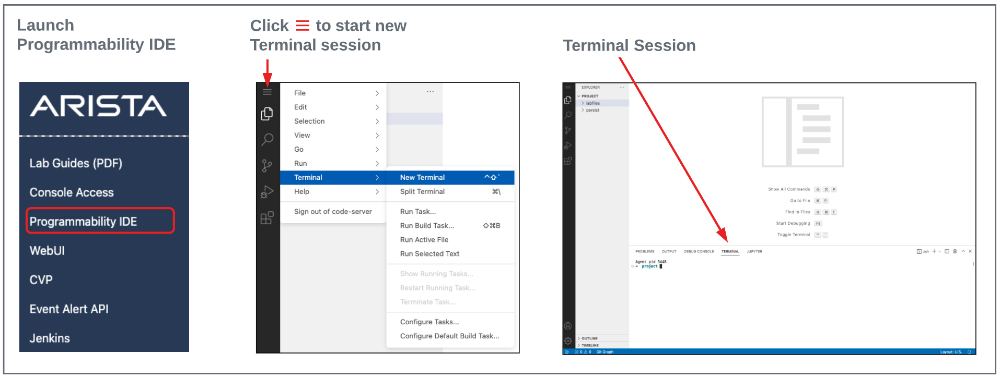

# lubrizol-poc-avd-atd
Lubrizol POC with AVD ATD

# Getting AVD going in the ATD programmability IDE
From your ATD environment, launch the programmability IDE, enter the password, and launch a new terminal:



## STEP #1 - Install deepmerge

- From the terminal session, run the following command.

``` bash
pip install deepmerge
```

## STEP #2 - Clone Necessary Repos

- Change working directory. Following commands will be executed from here.

``` bash
cd labfiles
```

- Clone the Ansible AVD Repo

``` bash
git clone https://github.com/aristanetworks/ansible-avd.git
```

- Clone the Ansible CVP Repo

``` bash
git clone https://github.com/aristanetworks/ansible-cvp.git
```

- Clone the POC Repo

``` bash
git clone https://github.com/PacketAnglers/lubrizol-poc-avd-atd.git
```

At this point you should see the 3 new directories under the labfiles directory:


## STEP #3 - Update Passwords and SSH Keys

The ATD Lab switches are preconfigured with MD5 encrypted passwords.  AVD uses sha512 passwords so we need to convert the current MD5 password to sha512.  **You will need to login to a switch to do this step.**

From the Programmibility IDE Explorer:

- Navigate to the `labfiles/cleveland-atd-avd/group_vars` folder.
- Click on the **group_vars/ATD.yml** file to open an editor tab.
- Update lines 5, 49, and 50.  **Follow** instructions per line below.

### Update Line 5

- Update `ansible_password` key (line 5) with your unique lab password found on the **Usernames and Passwords** section of your lab topology screen.

``` yaml
# group_vars/ATD.yml
#
# switch credentials
ansible_password: XXXXXXXXXXX
```

### Update Lines 49 & 50

- First, convert the current `arista` username type 5 password to a sha512 by running the following commands on one of your switches. Substitute XXXXXXX with your Lab's unique password.

``` bash
config
username arista privilege 15 role network-admin secret XXXXXXXX
```

- Retrieve password and ssh key for user `arista`.

``` bash
show run section username | grep arista
```

- Update the sha512_password and ssh_key with the above values. _Remember to keep the double quotes and DO NOT REMOVE `ssh-rsa` from the ssh_key._

- line 49 - `sha512_password:`
- line 50 - `ssh_key:`

Your file should look similar to below.  Use values your show command output above, as they are unique to your switches.

``` yaml
# group_vars/ATD.yml
#
# local users to be configured on switch
local_users:
  arista:
    sha512_password: "XXXXXXXXXXXXXX"
    ssh_key: "ssh-rsa XXXXXXXXXXXXXXXXXXX"
```
